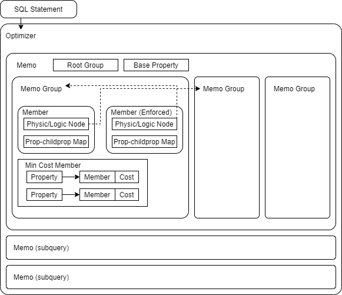

## Document for property enforcement

### Properties
1) **Order**:
- order: the data is ordered on a list of expressions
2) **Distribution**:
- singleton: not distributed, only working on a single machine
- distributed: distributed on a specific list of expressions
- replicated: data is replicated among all the machines.
- distributedany: data is distributed, but the list of expressions is not restricted

### Objects


This figure demonstrates the layout of all the relavent objects within the query optimizer. All the objects mentioned below are defined in [optimizer.cs](../qpmodel/optimizer.cs)
- Optimizer: Lies within each SQL Statement object.
- Memo: Corresponds to each logic tree. A cached subquery may have its own memo object within the same optimizer.
- Memo group: Corresponds to each node in the logic tree.
- Member: Corresponds to each logically equivalent LogicNode or PhysicNode within the same group.
- Property: The property requirement object.


### General framework
As mentioned in the main document, the query optimizer is a top-down structure following the cascade framework. The raw logic tree is provided to the optimizer and then processed to a tree of memo groups, each group represents a set of logically equivalent nodes. During this step, logic nodes are also transformed into property requirements if possible, for example, the logic order node is to be converted into an order property instead of a memo group. Cached subqueries shall have their separate trees. 

After the groups are produced, there will be an exploration step to transform the original logic node to new equivalent logic nodes or corresponding physic nodes. It is also possible that transformation leads to new memo groups, for example, a join tree involving three or more tables may be rotated to generate new groups. Join solver can also be used in lieu of transformation for multiple join. When exploration is complete, the groups now contain lists of members that are either logic or physic node, the child of which refers to child groups (`PhysicMemoRef/LogicMemoRef`).

Properties are required on top of the memo groups, and requirements may be propagated to child groups or new requirements may be imposed by certain physical nodes. By default, the required property of the final output is `<singleton, no order>`. If some logic nodes are transformed into requirement, the base requirement would be different.

Finding the optimal plan is a top-down recursive calling process. The function call uses the memo group called upon and the property requirement on that group, and returns the member with the minimum cost, starting from the root group and base requirement. For each function call, first the required property is transformed to a list of sub-properties that can turn into the current requirement through a single enforcement node. For example, `<singleton, order(a1)>` have sub-property of `<singleton, no order>` since it can be turned into `<singleton, order(a1)>` using a single `PhysicOrder(a1)` node. Each sub-property corresponds to a new enforcement member being added to the member list. All enforcement nodes are single physic node with only one child—the PhysicMemoRef back to the same group but with a different property requirement.

Each sub-property will be called upon to find the optimal member for that specific property. All the property requirements, including the derived sub-properties, and their corresponding optimal member is kept in a dictionary within the memo group object. If the find min-cost member function is called upon with the property requirement that has been called before, the recorded optimal member will be directly returned.

After derivation of less restrictive sub-properties, we look for the member with minimum cost. This consists of two parts: go through member list to find directly supplied members, and go through sub-property list to find enforced member. 

For each member, if it is a physic node, it will be checked if the required property can be fulfilled. If so, the total cost of that member will be calculated by summing the cost of that node and the minimum costs of child group members that can supply the property requirements imposed on the child groups. The specifics of this step will be further discussed in the physic node and property section.

Similarly, for each sub-property, since the finding minimum function is already called upon, the total cost would be sum of enforcement node cost and the total cost of the member fulfilling the sub-property.

When the recursive calls are complete, the min-cost member will be extracted to form a tree of physic nodes without PhysicMemoRef, and this three will be further used for execution.

### Interaction of properties
Interaction of properties refers to the transformation of a property requirement to less restricted property requirement.

1) **Order**: 
- Order to no order:  
`<singleton, order(a1,b1,b2)> -> <singleton, no order>`  
Order must be singleton; this is asserted throughout the process. Apparently, order can be enforced through *sort*. However, we are not assuming the sorting algorithm to be stable, so there are no partially fulfilled order, meaning an order property is fulfilled or not fulfilled at all. If a requirement is `<singleton, order(a1,b1,b2)>`, the received data stream of `<singleton, order(b1,b2)>` would still require a `PhysicOrder` node sorting the whole thing again.

2) **Distribution**
- Singleton to anydistribution or replicated distribution:  
`<singleton, no order> -> <anydistributed, no order>, <replicated, no order>`  
Singleton can be achieved by anydistributed or replicated through *gathering*, the first is a gathering over all the running machines, the second is getting the data from only one machine.
- Distributed to any distribution:  
`<distributed(a1), no order> -> <anydistributed, no order>`    
Distribution on a certain list of expressions can be achieve through *redistribution*, and the previous distribution does not matter as long as it is also distributed.

### Property and physic node
Property is always required upon the physic node instead of physic node providing a list of possible properties. It is designed this way because a node may be able to preserve certain property from the child group. For example, NLJoin can preserve the order of the building side, and the specific order actually depend on the child group, which cannot be known in advance. 
There is a method for physic node object to determine if the it can provide the required property. For the NLJoin case, now the property requirement can be propagated to build end child group.

### Example
Given table *a* as listed below, and table *b* having the same data.

a1 |a2 |a3 | a4
---|---|---|---
0 | 1 | 2 | 3
1 | 2 | 3 | 4
2 | 3 | 4 | 5

Take this query as an example:
`SELECT a1, b1 FROM a, b WHERE a2>b1 AND a1>=1 ORDER BY a2`

The logic tree of this query is:
```
LogicOrder 1091
    Order by: a2[1]
    -> LogicJoin 1087
        Filter: a2[1]>b1[0]
        -> LogicScanTable 1088 a
            Filter: a1[0]>=1
        -> LogicScanTable 1089 b
```

Without property enforcement, this query will just be transformed into physic tree of very similar layout, with PhysicOrder on top. The transformation will be limited to the Join(a,b) or Join(b,a). However, it is not the optimal plan because there are more rows after the join, and there will be more cost associated with PhysicOrder.  
The physic plan generate with property enforcement is shown below. PhysicOrder is pushed below because it is interpreted as the base property requirement imposed on the Memo, and NLJoin is able to propagate the order requirement downward. This is also the case for distributed plan. Previously, the distributed tables are directly redistributed before the hashjoin to match the join keys, and that method may output suboptimal physic plan for queries involving a mix of distributed and replicated tables. Now the property requirement may be pushed down to do in advance or delayed to the top depending on the cardinality.
```
PhysicNLJoin 1105_1132  (inccost=163.58, cost=156, rows=3) (actual rows=5)
    Output: a1[0],b1[2]
    Filter: a2[1]>b1[2]
    -> PhysicOrder 1129_1135  (inccost=4.58, cost=1.58, rows=2, memory=16) (actual rows=2)
        Output: a1[0],a2[1]
        Order by: a2[1]
        -> PhysicScanTable 1123_1137 a (inccost=3, cost=3, rows=2) (actual rows=2)
            Output: a1[0],a2[1]
            Filter: a1[0]>=1
    -> PhysicScanTable 1122_1140 b (inccost=3, cost=3, rows=3) (actual rows=3, loops=2)
        Output: b1[0]
```
